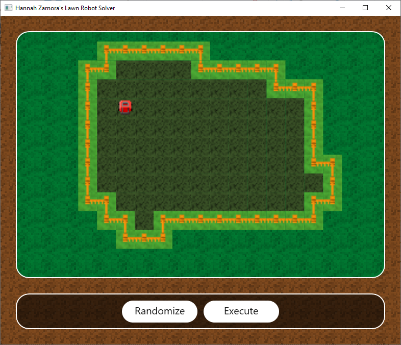

## Introduction
Lawn Robot Simulator

Developer: Hannah Zamora

## Motivation
This project was inspired by an interview question that was not able to be fully explored during the quick one hour interview period, involving a programmable lawn mower given three simple API methods available to it:

- void Mow()
- void TurnRight()
- bool Go()

Where the third call to Go would move forward one step, and would return true on success and false if it could not because of an obstruction. I was able to begin to set up a solution to this problem, but the breadth of the problem did not match the available time, so I was only able to explore this question at the highest of levels.

This project is a more thorough, full implementation of this programming question. It is a C# WinUI3 application that depicts a randomly generated lawn, a button to generate a new lawn, and a button to execute the algorithm to mow the entire lawn.

## Disclaimer
While the art style used for this application has clear inspirations, to avoid any issues all image assets were produced from scratch, either with perlin noise, noise with gaussian blurs, or manual pixel art. This was done in Paint.NET and all the .PDN files are checked in to this repository as well.

## Overview
The overall approach to how the solver is implemented is as followed.

- Consider the grid as a graph of nodes, where each node as Up/Down/Left/Right orthoganally adjacent nodes. Nodes can be either Grass, an Obstacle, or nodes that have not been navigated to are Unvisted.
- Maintain a list of all Unvisted nodes as you travel across the lawn that are orthongally adjacent to the set of all visited nodes.
- Start wherever the lawn mower is initially placed, assuming the lawn mower is always placed facing upward relative to this 2D grid (without loss of generality), ie with a (0,1) directional vector.
- Starting with a ray pointing straight up from the start point, sort all nodes based on first their clockwise angle relative to that ray, and then their distance to the lawn mower.
- Calculate a path to that target node using visited nodes (more on this below), and use any needed Go() and TurnRight() commands to traverse the path.
- Perform the same operation, continuing the ray with a new direction based on the angle from the center of the node that was targeted. Do this to target the next node.
- Continue until our collection of Unvisted nodes is empty.

The approach here is to spiral around the start point. By sweeping a ray clockwise around the start point, we can produce a spiral that mostly uses right turns, that minimizes calls to TurnRight(). We spiral as much as we can until we exhaust all of our input.

When it comes to finding a path from one node to another, we can take this approach:
- On a grid mirroring the size of the known lawn, note grid locations that have been visited as well as the target node.
- Make note of the lawn mower's location and the target node in this grid.
- Starting at i=0 'color' on this grid the lawn mower's location with the value "[i]"
- For each iteration, 'color' all orthogonally adjacent locations to [i] with the value "[i+1]".
- Continue until the entire grid of visited locations is colored.
- Starting at the target node, which is colored with the value j, push that node onto a stack.
- Find an orthogonally adjacent node that is colored [j-1], and push that onto the stack.
- Continue this process until we push a node colored [0] onto the stack.
- The stack now holds the path we must travel.

We also randomly generate a lawn at the beginning of this simulation. This is done by:
- Define a maximally defined grid (in this case, 15x10) that is the max size of our lawn, each node initialized to 'Obstacle'.
- Considering a random internal pixel of a maximally defined grid (in this case, 15x10).
- Generate 20 values multiplier_i from 0.5 to 1.0
- Blur/smooth out the multiplier array by applying a [1/5, 1/5, 1/5, 1/5, 1/5] kernel to each 'pixel' of this 1D array.
- Calculate 20 rays from the internal pixel from the first step extending outward to the outer permiter of the grid at 2*pi/20 radians apart.
- Multiple each ray_i by multiplier_i.
- Produce a mesh of triangles that represents the entire shape produced by the endpoints of these rays.
- For each grid element of the lawn that lies within the mesh, mark it as 'Grass'. This is done by testing it against every triangle produced by two adjacent ray endpoints and the center point.

I had this approach in mind as being fairly simple, and once I got it all working it generates pretty decent lawns!

## Results
I had time to develop much of this application, and got everything working with the exception of the solver. That was the most interesting part of this application, but I didn't quite finish that part. It can be seen in isolation in LawnSolver.cs. The rest of the solution took some time, as I did a lot of work here with WinUI3 which didn't want to cooperate. I also spent a good amount of time on the visual style of the application, which didn't get exactly the level of polish I was hoping yet. In time I may revisit this project and fully complete it end to end.

## Conclusion
This is a cute programming project that I had fun exploring further. There are more considerations to be had with the problem. Currently we consider the entire lawn as a grid, where obstructions are either the edges of the lawn, or some kind of entire grid-cell obstruction. It's possible for a grid cell to be obstructed, alternatively, only from one direction. Consider a stick that only lies on one of the perimeter edges of a grid square.

There is certainly more complexity that can be explored here beyond the simple abstraction that the API above implies, but the sky is the limit for how deep one could go in simulating this scenario.
